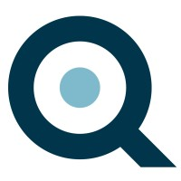
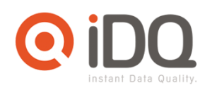
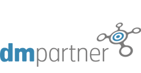
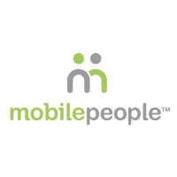
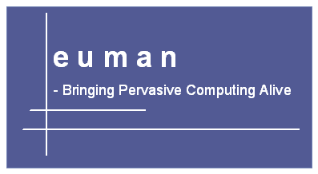
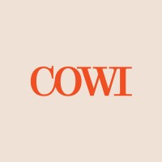
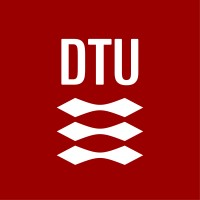
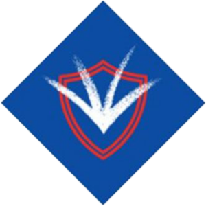

# Experience & Education

Retrieved from [linkedin.com/in/jjkramhoeft](https://www.linkedin.com/in/jjkramhoeft/) on 2026-09-27. Durations are as LinkedIn showed them on that date.

## Experience

### BiQ A/S - Better Data & Decision Quality

- **Senior Developer** · Full-time · On-site
  - Feb 2023 – Present · 3 yrs 8 mos
  - Copenhagen Metropolitan Area

### bdq a/s

- **Senior Developer & Data Specialist** · Full-time
  - 2021 – Present
  - Copenhagen Metropolitan Area

### iDQ A/S

9 yrs 9 mos in total.

- **Senior Developer & Data Specialist**
  - Jan 2017 – Sep 2021 · 4 yrs 9 mos
  - Copenhagen Area, Denmark
- **Chief Developer & IT Project Manager**
  - Jan 2012 – Jan 2017 · 5 yrs 1 mo
  - Copenhagen Metropolitan Area

### DM Partner A/S

- **Chief Developer and IT Project Manager**
  - Nov 2009 – Dec 2011 · 2 yrs 2 mos

### mobilePeople Inc

- **Senior Technical Product Manager**
  - Apr 2006 – Sep 2009 · 3 yrs 6 mos

### Euman A/S

- **System Architect**
  - 2000 – 2006

### COWI

- **System Developer**
  - 1997 – 2000

## Education

### DTU - Technical University of Denmark

- **M.Sc., Computer Modelling**
  - 1989 – 1995

### Kildegaard Gymnasium

- 1976 – 1989

## Logos

Four logos are 200×200 JPEGs from the organisations' LinkedIn pages. The other five have no LinkedIn logo, so they come from the organisations' own websites. bdq.dk, idq.dk and dmpartner.dk no longer exist, so those three come from Wayback Machine snapshots.

| Organisation | File | Size | Source |
|---|---|---|---|
| BiQ A/S - Better Data & Decision Quality | `logos/biq.jpg` | 200×200 | [LinkedIn company/112041](https://www.linkedin.com/company/112041/) |
| bdq a/s | `logos/bdq.png` | 119×44 | [bdq.dk, archived Jan 2022](https://web.archive.org/web/20220107125337/https://www.bdq.dk/wp-content/uploads/2021/08/bdqx1.png) |
| iDQ A/S | `logos/idq.png` | 300×138 | [idq.dk, archived Dec 2020](https://web.archive.org/web/20201209110410/https://idq.dk/) |
| DM Partner A/S | `logos/dmpartner.gif` | 230×120 | [dmpartner.dk, archived Jan 2012](https://web.archive.org/web/20120106214223/http://www.dmpartner.dk/) |
| mobilePeople Inc | `logos/mobilepeople.jpg` | 200×200 | [LinkedIn company/104058](https://www.linkedin.com/company/104058/) |
| Euman A/S | `logos/euman.gif` | 397×218 | [euman.com, archived Mar 2006](https://web.archive.org/web/20060310052252/http://www.euman.com/) |
| COWI | `logos/cowi.jpg` | 200×200 | [LinkedIn company/163233](https://www.linkedin.com/company/163233/) |
| DTU - Technical University of Denmark | `logos/dtu.jpg` | 200×200 | [LinkedIn school/3933](https://www.linkedin.com/school/3933/) |
| Kildegaard Gymnasium | `logos/kildegaard.png` | 300×300 | [kildegaard.dk](https://kildegaard.dk/) |

Notes:

- `bdq.png` is a white-and-orange logo on a transparent background, so it only shows up on dark backgrounds. It is the only version the archive holds, and it is small.
- `euman.gif` is Euman's 2006 homepage splash: the "euman" wordmark and tagline on a blue panel, not a standalone logo.
- Kildegaard Gymnasium now runs as Kildegård Privatskole at the same address (Kildegårdsvej 87, Hellerup). `kildegaard.png` is the school's current crest.
